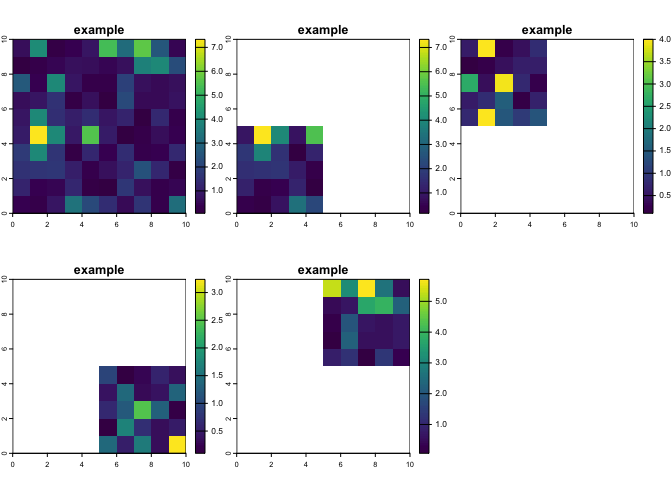
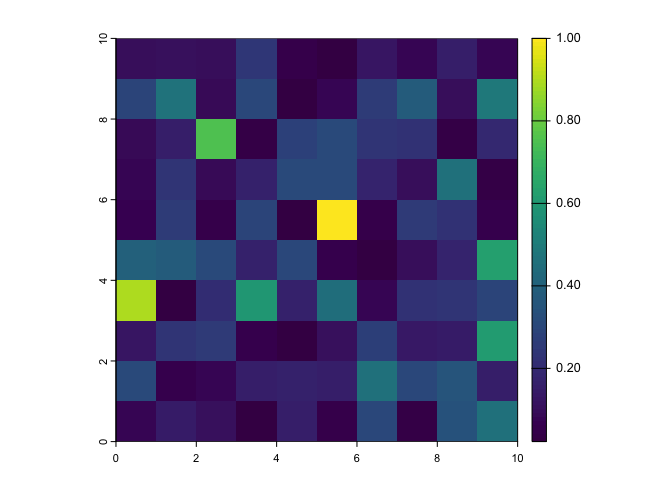

<!-- README.md is generated from README.Rmd. Please edit that file -->

# sdmtools

<!-- badges: start -->

[](https://github.com/idem-lab/sdmtools/actions/workflows/R-CMD-check.yaml)
[](https://app.codecov.io/gh/idem-lab/sdmtools?branch=main)

[](https://lifecycle.r-lib.org/articles/stages.html#experimental)


[](https://app.codecov.io/gh/idem-lab/sdmtools)
<!-- badges: end -->

A set of helper functions to facilitate species distribution modelling.

## Installation

You can install `sdmtools` with:

``` r
install.packages(
"sdmtools",
repos = "https://idem-lab.r-universe.dev"
)
```

## Data

``` r
library(sdmtools)
```

`raster_to_terra` — an annotated equivalence table of functions from the
`raster` and `terra`. First 5 lines:

<table>
<thead>
<tr>
<th style="text-align:left;">
raster
</th>
<th style="text-align:left;">
terra
</th>
<th style="text-align:left;">
comment for terra use
</th>
</tr>
</thead>
<tbody>
<tr>
<td style="text-align:left;">
raster, brick, stack
</td>
<td style="text-align:left;">
rast
</td>
<td style="text-align:left;">
NA
</td>
</tr>
<tr>
<td style="text-align:left;">
rasterFromXYZ
</td>
<td style="text-align:left;">
rast(, type=‘xyz’)
</td>
<td style="text-align:left;">
note arg `type = xyz`
</td>
</tr>
<tr>
<td style="text-align:left;">
stack, addLayer
</td>
<td style="text-align:left;">
c
</td>
<td style="text-align:left;">
NA
</td>
</tr>
<tr>
<td style="text-align:left;">
addLayer
</td>
<td style="text-align:left;">
add\<-
</td>
<td style="text-align:left;">
NA
</td>
</tr>
<tr>
<td style="text-align:left;">
area
</td>
<td style="text-align:left;">
cellSize or expanse
</td>
<td style="text-align:left;">
NA
</td>
</tr>
</tbody>
</table>

`global_regions` — a tibble showing the WHO region, UN region, and
continent for for 249 countries and country-like things. First 5 lines:

<table>
<thead>
<tr>
<th style="text-align:left;">
country
</th>
<th style="text-align:left;">
iso2
</th>
<th style="text-align:left;">
iso3
</th>
<th style="text-align:left;">
who_region
</th>
<th style="text-align:left;">
un_region
</th>
<th style="text-align:left;">
continent
</th>
</tr>
</thead>
<tbody>
<tr>
<td style="text-align:left;">
Afghanistan
</td>
<td style="text-align:left;">
AF
</td>
<td style="text-align:left;">
AFG
</td>
<td style="text-align:left;">
Eastern Mediterranean
</td>
<td style="text-align:left;">
Asia-Pacific States
</td>
<td style="text-align:left;">
Asia
</td>
</tr>
<tr>
<td style="text-align:left;">
Albania
</td>
<td style="text-align:left;">
AL
</td>
<td style="text-align:left;">
ALB
</td>
<td style="text-align:left;">
Europe
</td>
<td style="text-align:left;">
Eastern European States
</td>
<td style="text-align:left;">
Europe
</td>
</tr>
<tr>
<td style="text-align:left;">
Algeria
</td>
<td style="text-align:left;">
DZ
</td>
<td style="text-align:left;">
DZA
</td>
<td style="text-align:left;">
Africa
</td>
<td style="text-align:left;">
African states
</td>
<td style="text-align:left;">
Africa
</td>
</tr>
<tr>
<td style="text-align:left;">
American Samoa
</td>
<td style="text-align:left;">
AS
</td>
<td style="text-align:left;">
ASM
</td>
<td style="text-align:left;">
NA
</td>
<td style="text-align:left;">
NA
</td>
<td style="text-align:left;">
Oceania
</td>
</tr>
<tr>
<td style="text-align:left;">
Andorra
</td>
<td style="text-align:left;">
AD
</td>
<td style="text-align:left;">
AND
</td>
<td style="text-align:left;">
Europe
</td>
<td style="text-align:left;">
Western European and other States
</td>
<td style="text-align:left;">
Europe
</td>
</tr>
</tbody>
</table>

### Data-generating functions

The package `terra` is fiddly about storing its `spat...` objects in
packages, so we chose to generate example spatial data on-demand using
functions, rather than storing it.

`example_raster` — an example `spatRaster`.

``` r
library(terra)
#> terra 1.8.5
r <- example_raster()
r
#> class       : SpatRaster 
#> dimensions  : 10, 10, 1  (nrow, ncol, nlyr)
#> resolution  : 1, 1  (x, y)
#> extent      : 0, 10, 0, 10  (xmin, xmax, ymin, ymax)
#> coord. ref. :  
#> source(s)   : memory
#> name        :   example 
#> min value   : 0.0627102 
#> max value   : 7.3352526
plot(r)
```


`example_vector` — an example `spatVector`.

``` r
library(terra)
v <- example_vector()
v
#>  class       : SpatVector 
#>  geometry    : points 
#>  dimensions  : 10, 0  (geometries, attributes)
#>  extent      : 0.2293562, 8.00672, 1.375653, 8.951683  (xmin, xmax, ymin, ymax)
#>  coord. ref. :
plot(v)
```


`make_africa_mask` — makes a mask layer of Africa based on shapefiles
from `malariaAtlas::getShp`. Can produce either a `SpatRaster` or
`SpatVector`.

``` r
library(terra)
africa_mask <- make_africa_mask(type = "vector")
#> Loading ISO 19139 XML schemas...
#> Loading ISO 19115 codelists...
#> Please Note: Because you did not provide a version, by default the version being used is 202403 (This is the most recent version of admin unit shape data. To see other version options use function listShpVersions)
#> Start tag expected, '<' not found
#> Start tag expected, '<' not found
#> although coordinates are longitude/latitude, st_union assumes that they are
#> planar
#> Warning: [crs<-] not all geometries were transferred, use svc for a geometry
#> collection
plot(africa_mask)
```


## Function examples

`rastpointplot` — simple utility to plot a raster with points over it.

``` r
rastpointplot(r,v)
```


`source_R` — source all R files in a target directory

``` r
source_R("/Users/frankenstein/project/R") # do not run
```

`import_rasts` — import all rasters from a directory into a single
object

``` r
rasters <- import_rasts("/data/grids/covariates") # do not run
```

`split_rast` — split a raster.

``` r
r <- example_raster()

s <- split_rast(r, grain = 2)

s
#> [[1]]
#> class       : SpatRaster 
#> dimensions  : 5, 5, 1  (nrow, ncol, nlyr)
#> resolution  : 1, 1  (x, y)
#> extent      : 0, 5, 0, 5  (xmin, xmax, ymin, ymax)
#> coord. ref. :  
#> source(s)   : memory
#> name        :   example 
#> min value   : 0.1587361 
#> max value   : 7.3352526 
#> 
#> [[2]]
#> class       : SpatRaster 
#> dimensions  : 5, 5, 1  (nrow, ncol, nlyr)
#> resolution  : 1, 1  (x, y)
#> extent      : 0, 5, 5, 10  (xmin, xmax, ymin, ymax)
#> coord. ref. :  
#> source(s)   : memory
#> name        :   example 
#> min value   : 0.1028045 
#> max value   : 4.0001839 
#> 
#> [[3]]
#> class       : SpatRaster 
#> dimensions  : 5, 5, 1  (nrow, ncol, nlyr)
#> resolution  : 1, 1  (x, y)
#> extent      : 5, 10, 0, 5  (xmin, xmax, ymin, ymax)
#> coord. ref. :  
#> source(s)   : memory
#> name        :    example 
#> min value   : 0.09802478 
#> max value   : 3.23820739 
#> 
#> [[4]]
#> class       : SpatRaster 
#> dimensions  : 5, 5, 1  (nrow, ncol, nlyr)
#> resolution  : 1, 1  (x, y)
#> extent      : 5, 10, 5, 10  (xmin, xmax, ymin, ymax)
#> coord. ref. :  
#> source(s)   : memory
#> name        :   example 
#> min value   : 0.0627102 
#> max value   : 5.7145289
```

``` r
ps <- lapply(
  s,
  FUN = extend,
  y = r
) |>
  rast()

c(
  r,
  ps
) |>
  plot()
```



### Functions for a species distribution modelling workflow

We have some covariate layers: `cov1` and `cov2`

``` r
library(terra)

cov1 <- example_raster(
  seed = -44,
  layername = "cov1"
)
cov2 <- example_raster(
  seed = 15.3,
  layername = "cov2"
)

covs <- c(cov1, cov2)
```

`std_rast` — standardise a `spatRaster` by transforming it to have a
range of 0—1

``` r
cov1_st <- std_rast(cov1)

plot(cov1_st)
```



We have some presences and absences

``` r
presences <- example_vector(seed = 68) %>%
  as.data.frame(geom = "xy")
absences <- example_vector(seed = 9.6) %>%
  as.data.frame(geom = "xy")

presences
#>           x        y
#> 1  9.244899 5.033042
#> 2  6.612025 1.559797
#> 3  4.024099 8.750261
#> 4  6.370063 4.438317
#> 5  3.526324 6.598762
#> 6  7.476441 7.754586
#> 7  7.175489 8.123659
#> 8  1.935898 5.082858
#> 9  3.331217 7.974853
#> 10 1.365547 5.741829
```

`extract_covariates` — extract covariate values from `spatRaster` or
`raster` layers for a given set of points

Pass in either `presences` and `absences` as a `data.frame` or `tibble`
of with , or `presences_and_absences` as a single data frame points with
a presence or ID column(s)

``` r
sdm_data <- extract_covariates(
  covariates = covs,
  presences = presences,
  absences = absences
)
```

We can then make a spatial prediction of our model using `predict_sdm`
and write and read it out in a single step with `writereadrast`, and
write it to a temporary file with `temptif`:

``` r
# first we make a simple model, using data from above
m <- glm(presence ~ cov1 + cov2, data = sdm_data)

prediction_rast <- predict_sdm(m, covs) |>
  writereadrast(filename = temptif())

plot(prediction_rast)
```


